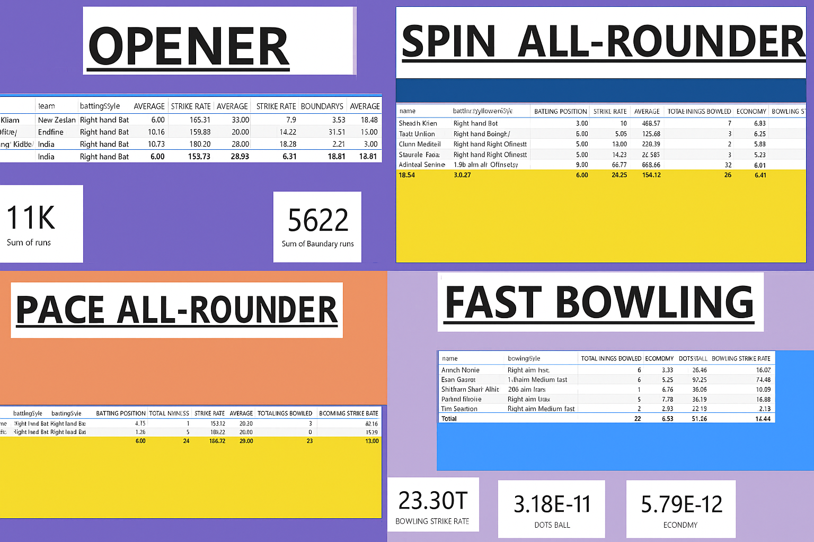

# 🏏 Power BI Cricket Dashboard: Top 11 Players of the World Cup

This project is a **Power BI-based cricket analysis dashboard** focused on selecting the **Top 11 Players of a World Cup squad** based on in-depth player statistics and role-specific performance metrics.

It visualizes player data across five key cricketing roles:

- 🔓 Openers
- 🧱 Middle Order Batsmen
- ⚡ Pace All-Rounders
- 🎯 Spin All-Rounders
- 🚀 Fast Bowlers

## 🏆 Objective: Best XI for the World Cup

The goal of this dashboard is to help analysts, selectors, or fans:
- Evaluate performance across different cricketing skills
- Compare candidates for each position
- Objectively shortlist the **Best Playing XI** based on data

Each page in the report represents a role in the playing XI, with statistics carefully curated to identify top performers suited for World Cup matches.
## 📊 Dashboard Summary

This Power BI dashboard includes:

### 1️⃣ **OPENER**
- Key Metrics: Batting average, Strike rate, Boundary %, Early overs performance

### 2️⃣ **MIDDLE ORDER**
- Key Metrics: Pressure-handling, Finishing ability, Dot ball %, Clutch runs

### 3️⃣ **PACE ALL-ROUNDER**
- Key Metrics: Batting & Bowling balance, Impact index, Death over stats

### 4️⃣ **SPIN ALL-ROUNDER**
- Key Metrics: Economy rate, Wicket-taking consistency, Useful cameos

### 5️⃣ **FAST BOWLING**
- Key Metrics: Wickets taken, Strike rate, Bowling speed, Death-over economy

## 🖼️ Dashboard Preview

## 🔍 Features

- 🎯 Role-specific dashboards for deep analysis
- 📉 Interactive charts: bar plots, line graphs, comparative visuals
- 🧠 Smart KPIs: Average, Strike Rate, Economy, Role Fit Score
- ⚙️ Power BI slicers for dynamic filtering
- 💡 Clean, insightful layout for decision-making

## 🛠️ Tools & Technologies

- **Power BI Desktop** – for data modeling and visualization
- **Microsoft Excel** – raw data processing
- **PNG Export** – static snapshots for web sharing
- **Markdown** – for GitHub documentation

